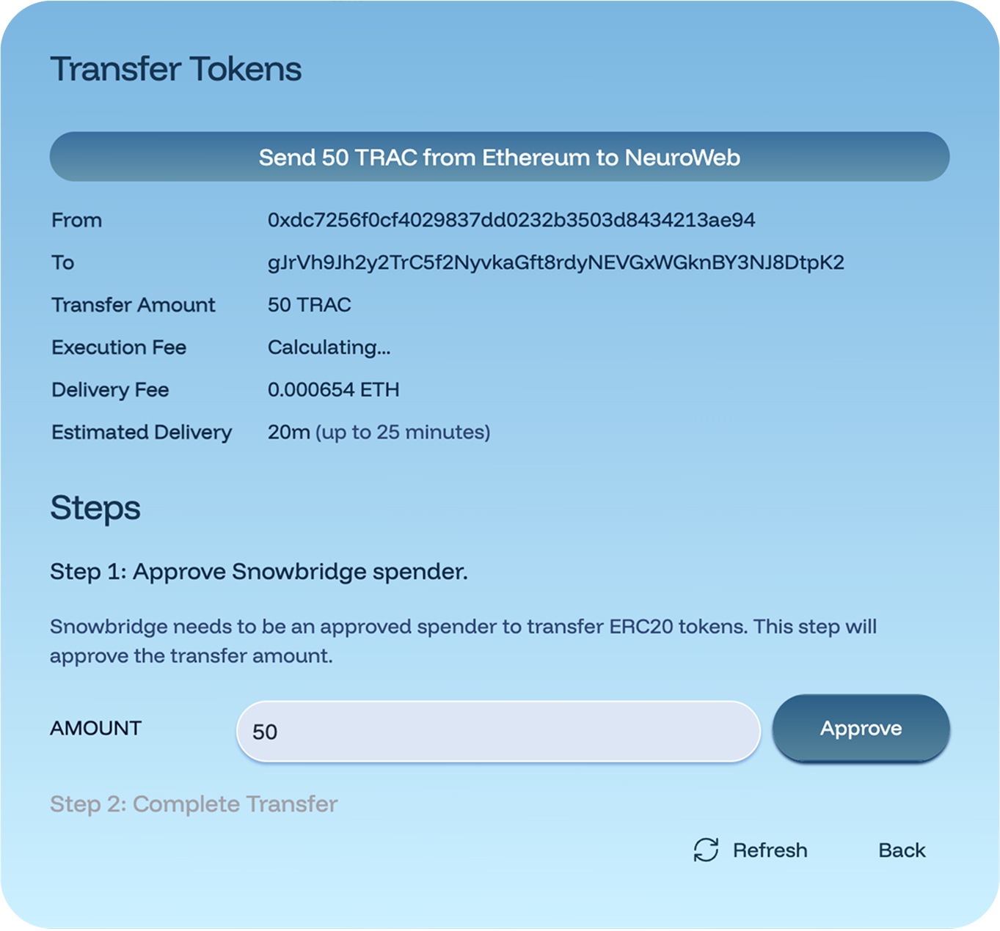
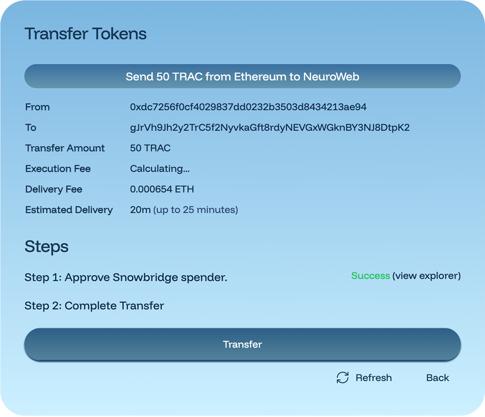
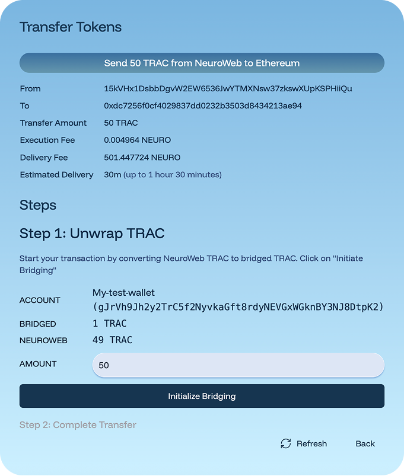

# Ethereum-NeuroWeb TRAC Bridge

The TRAC Bridge between Ethereum and Neuroweb leverages [**SnowBridge**](https://app.snowbridge.network/)**, a trustless, Polkadot-native bridge,** **secured entirely by Polkadot’s blockchain instead of third-party services or risky multisigs**. This means the bridge is **backed in its entirety by the consensus mechanisms of Ethereum and Polkadot** (which has the highest Nakamoto coefficient of all blockchains).

\
To start bridging, visit the [**Snowbridge UI here**](https://app.snowbridge.network/) and follow the steps below


Neuroweb **supports 2 wallet groups: Ethereum wallets (EVM-compatible) and Substrate wallets (Polkadot).** Bridging from Ethereum to Neuroweb involves **using both wallets:**

* **Ethereum wallet** on the Ethereum side,&#x20;
* **Substrate wallet** on the NeuroWeb side.


## Bridging TRAC from Ethereum to Neuroweb

Before you begin, make sure you have an:

* **Ethereum account on an Ethereum wallet** (e.g. [Rabby](https://rabby.io/), [MetaMask](https://app.gitbook.com/u/SnKqSktA1lQxN1YlAv4xn5Oketp1)) with:
  * **TRAC tokens** you want to bridge
  * **ETH** to pay for transaction fees
* **NeuroWeb account** on a Polkadot-compatible wallet like [Talisman](https://talisman.xyz/), [Nova Wallet](https://novawallet.io/), [SubWallet](https://www.subwallet.app/), etc.:
  * **NEURO** tokens in the account (required for the final step)


To use your bridged TRAC for **staking** or **publishing on the DKG**, you must first **map your Polkadot (NeuroWeb) address to your** **EVM address** using this [mapping interface](https://neuroweb.ai/evm).


### 1. Select the direction from Ethereum to Neuroweb

Visit the [**Snowbridge UI here**](https://app.snowbridge.network/). Choose the right blockchains

* **FROM:** Ethereum
* **TO:** NeuroWeb

<figure><figcaption></figcaption></figure>

### 2. Connect your wallets

1. Click **Connect Wallet** and choose your Ethereum wallet (e.g., MetaMask).\
   Follow the prompts: once connected, you’ll see your Ethereum address in the **FROM ACCOUNT** field.

<figure><figcaption></figcaption></figure>

2. Click **Connect Wallet** again to connect your NeuroWeb wallet.\
   Select your Polkadot-compatible wallet and account.


**NOTE:** Your NeuroWeb account **must be funded with NEURO tokens** for the finalization step.


After both wallets are connected, the form should look like the example below.

<figure><figcaption></figcaption></figure>

### 3. Enter the amount to bridge

* Insert how many TRAC tokens you want to bridge in the **amount** field
* Click **Submit**.

After you click **Submit**, a new confirmation screen will appear showing the bridging details, including the amount and the addresses involved. Take a moment to review this information before continuing.

<figure><figcaption></figcaption></figure>


**Double-check both addresses** (your Ethereum sender & NeuroWeb recipient).


### 4. Execute Approve & Transfer transactions on Ethereum

A confirmation screen will show the details of the bridge transaction.

1. Click **Approve**. Your Ethereum wallet will pop up to initiate the TRAC approval
2. Click **Transfer**. Your wallet will pop up again — confirm the transfer transaction.
3. Wait until the bridge shows that the transfer is complete. This transfer can take up to 25 minutes in the current version of Snowbridge.

<figure><figcaption></figcaption></figure>

### 5. Wait for finalization

You will be moved to a window showing the transaction status. This step may take up to 25 minutes.


**NOTE:** You’re almost done! After this transaction is confirmed, there’s one more quick step: you’ll need to **finalize the bridging** to complete the transfer and receive your TRAC on NeuroWeb.


<figure><figcaption></figcaption></figure>

When the transfer is confirmed, the **Finalize Bridging** button becomes active.

<figure><figcaption></figcaption></figure>

### 6. Finalize Bridging (NeuroWeb)

1. Click **Finalize Bridging**.
2. Your NeuroWeb (Polkadot) wallet will pop up —  approve the transaction.
3. Once confirmed, your TRAC will be available in your NeuroWeb account.

Your TRAC is now on NeuroWeb and ready to use. If you mapped your addresses, you can start staking or publishing immediately.

For assistance, join the [OriginTrail Telegram channel](https://t.me/origintrail).

## Bridging TRAC from Neuroweb to Ethereum

Before you begin, make sure you have the following:

* **NeuroWeb account** on a Polkadot-compatible wallet like [Talisman](https://talisman.xyz/), [Nova Wallet](https://novawallet.io/), [SubWallet](https://www.subwallet.app/), etc.:
  * **TRAC** tokens you want to bridge
  * **NEURO** tokens to cover transaction fees
* **Ethereum account on an Ethereum wallet** (e.g. [Rabby](https://rabby.io/), [MetaMask](https://app.gitbook.com/u/SnKqSktA1lQxN1YlAv4xn5Oketp1)) with:
  * **ETH** tokens in the account (to pay for gas when finalizing the bridge)


**TIP:** Having both wallets installed and unlocked before starting will make the connection process smoother.


### 1. Select the direction from NeuroWeb to Ethereum

Visit the [**Snowbridge UI here**](https://app.snowbridge.network/). Choose the right blockchains

* **FROM:** NeuroWeb
* **TO:** Ethereum

<figure><figcaption></figcaption></figure>

### 2. Connect your wallets

1. Click the **Connect Wallet** button at the bottom of the form to link your **NeuroWeb wallet** ([Talisman](https://talisman.xyz/), [Nova Wallet](https://novawallet.io/), [SubWallet](https://www.subwallet.app/), etc.)**.** Once connected, your wallet name and address will appear in the **FROM ACCOUNT** field, just like in the example below.


**NOTE:** Make sure your NeuroWeb wallet has both **TRAC** (to bridge) and **NEURO** (to cover transaction fees).


<figure><figcaption></figcaption></figure>

2.  Click **Connect Wallet** again to connect your Ethereum wallet (e.g. [Rabby](https://rabby.io/), [MetaMask](https://app.gitbook.com/u/SnKqSktA1lQxN1YlAv4xn5Oketp1)).&#x20;

    Select your Ethereum-compatible wallet and account.

After both wallets are connected, the form should look like the example below.

<figure><figcaption></figcaption></figure>

### 3. Enter the amount to bridge

* Insert how many TRAC tokens you want to bridge in the **amount** field
* Click **Submit**

After clicking **Submit**, you’ll see a confirmation screen summarizing your transfer details. Take a moment to review this information carefully.

1. Before sending your tokens to Ethereum, you first need to **unwrap your TRAC**.\
   This step converts your NeuroWeb TRAC into “bridged TRAC,” which can then be transferred across the bridge.&#x20;

<figure><figcaption></figcaption></figure>

* In the form, review your account information and TRAC balance.
* Enter the amount you want to bridge in the **Amount** field.
* Click **Initialize Bridging** to start the unwrapping process.
* Approve the transaction in your NeuroWeb wallet.

Once completed, you’ll see a confirmation showing that Step 1 — _Unwrap TRAC_ — was successful.

2. After your TRAC has been unwrapped, the next step is to **complete the transfer**.

* You’ll see both steps listed in the interface:
  * Step 1: Unwrap TRAC ✅ _(Success)_
  * Step 2: Complete Transfer
* Click **Transfer** to continue with the bridging process.
* Approve the transaction again in your NeuroWeb wallet.


**NOTE:** Make sure you have enough NEURO in your wallet to cover the delivery and execution fees.


<figure><figcaption></figcaption></figure>

Confirm that all details are correct, then approve the transaction in your NeuroWeb wallet to continue. After approval, the transfer will begin and you’ll move to a progress screen that tracks your transaction status.


**NOTE:** You’ll see a short “Preflight checks successful” message before the transfer begins. This just means the bridge has verified that your transaction is valid and ready to go.


<figure><figcaption></figcaption></figure>

### 4. Wait for your transfer to complete

After approving the transaction in your NeuroWeb wallet, you’ll see a confirmation screen like the one below. It shows that your transfer has been successfully submitted and is now being processed by the bridge.

<figure><figcaption></figcaption></figure>


**NOTE:** Keep this page open until the transfer is finalized. You’ll see the status change to “Completed” once your TRAC arrives on Ethereum.


### 5. Confirm your transfer is complete

Once your transfer finishes, you’ll see a confirmation screen like the one below.

<figure><figcaption></figcaption></figure>

Your **Transfer Status** will change to **Complete**, which means your TRAC has successfully arrived on Ethereum.&#x20;

You can now:

* Click **Uniswap** to access your tokens directly in the app.
* Click **See in History** or **Transaction History** to review the full transfer details.


**NOTE:** You can also open your Ethereum wallet to confirm that your bridged TRAC tokens are visible there. If you don’t see them immediately, import the TRAC token contract address (0xaa7a9ca87d3694b5755f213b5d04094b8d0f0a6f) to display your balance.

