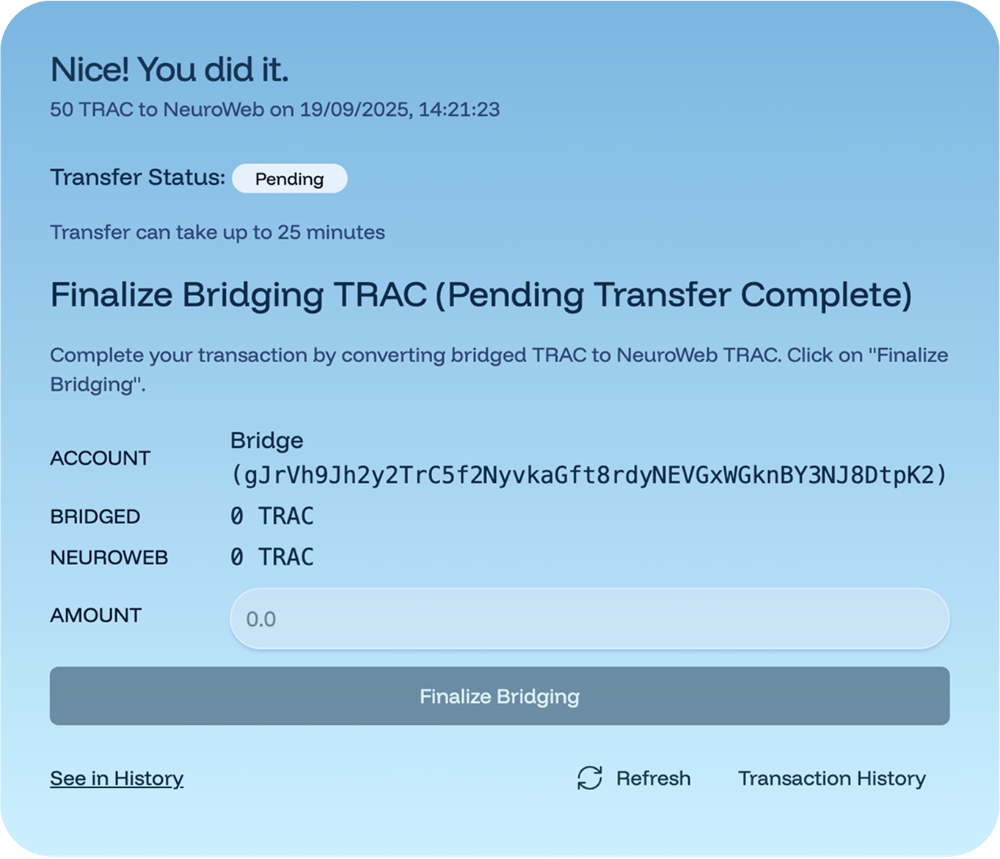
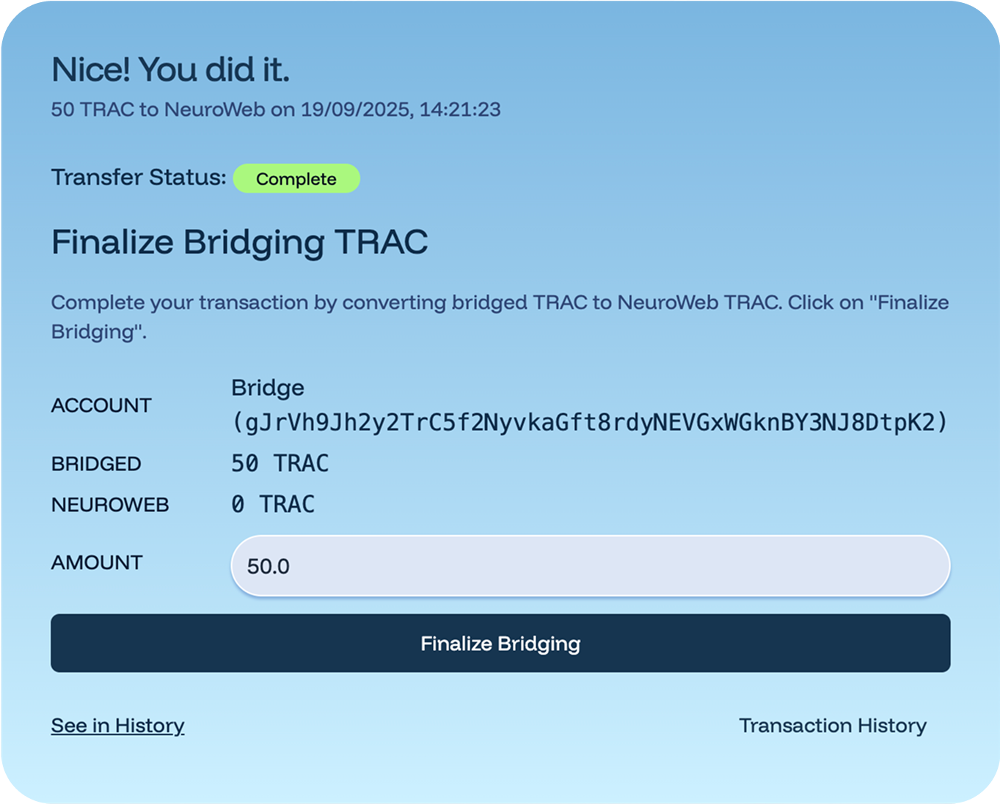

# Ethereum - NeuroWeb TRAC Bridge

The TRAC Bridge between Ethereum and Neuroweb leverages [**SnowBridge**](https://app.snowbridge.network/)**, a trustless, Polkadot-native bridge,** **secured entirely by Polkadot’s blockchain instead of third-party services or risky multisigs**. This means the bridge is **backed in its entirety by the consensus mechanisms of Ethereum and Polkadot** (which has the highest Nakamoto coefficient of all blockchains).

\
To start bridging, visit the [**Snowbridge UI here**](https://app.snowbridge.network/) and follow the steps below


Neuroweb **supports 2 wallet groups - Ethereum wallets (it is EVM compatible) and Substrate wallets (Polkadot). Bridging from Ethereum to Neuroweb involves using both wallets - an Ethereum wallet on Ethereum side, and Substrate wallet on the Neuroweb side.**



Snowbridge currently enables transfers of TRAC in the direction from Ethereum to Neuroweb - the opposite direction (Neuroweb to Ethereum ) is to be enabled by end of September 2025.


## Bridging TRAC from Ethereum to Neuroweb

Before you begin, make sure you have an:

* **Ethereum account on an Ethereum wallet** (e.g. [Rabby](https://rabby.io/), [MetaMask](https://app.gitbook.com/u/SnKqSktA1lQxN1YlAv4xn5Oketp1)) with:
  * **TRAC tokens** you want to bridge
  * **ETH** to pay for transaction fees
* **NeuroWeb account** on a Polkadot-compatible wallet like [Talisman](https://talisman.xyz/), [Nova Wallet](https://novawallet.io/), [SubWallet](https://www.subwallet.app/) etc:
  * **NEURO** tokens in the account (required for the final step)


To use your bridged TRAC for **staking** or **publishing on the DKG**, you must first **map your Polkadot (NeuroWeb) address to your** **EVM address** using this [mapping interface](https://neuroweb.ai/evm).


### 1. Select the direction from Ethereum to Neuroweb

Visit the [**Snowbridge UI here**](https://app.snowbridge.network/). Choose the right blockchains

* **FROM:** Ethereum
* **TO:** NeuroWeb

<figure><figcaption></figcaption></figure>

### 2. Connect your wallets

1. Click **Connect Wallet** and choose your Ethereum wallet (e.g. MetaMask).\
   Follow the prompts: once connected, you’ll see your Ethereum address in the **FROM ACCOUNT** field.

<figure><figcaption></figcaption></figure>

2. Click **Connect Wallet** again to connect your NeuroWeb wallet.\
   Select your Polkadot-compatible wallet and account.


**NOTE:** Your NeuroWeb account **needs to be funded with NEURO tokens** for the finalization step.


After both wallets are connected, the form should look like the example below.

<figure><figcaption></figcaption></figure>

### 3. Enter the amount to bridge

* insert how many TRAC tokens you want to bridge in the **amount** field
* Click **Submit**.

After you click **Submit**, a new confirmation screen will appear showing the details of bridging, including the amount and the addresses involved. Take a moment to review this information before continuing.

<figure><figcaption></figcaption></figure>


**Double-check both addresses** (your Ethereum sender & NeuroWeb recipient).


### 4. Execute Approve & Transfer transactions on Ethereum

A confirmation screen will show the details of the bridge transaction.

1. Click **Approve**. Your Ethereum wallet will pop up to initiate the TRAC approval
2. Click **Transfer**. Your wallet will pop up again - confirm the transfer transaction.
3. Wait until the bridge shows that the transfer is complete. This transfer can take up to 25mins in the current version of Snowbridge.

<figure><figcaption></figcaption></figure>

### 5. Wait for finalization

You will be moved to a window showing the transaction status. This step may take up to 25 minutes.


**NOTE:** You’re almost done! After this transaction is confirmed, there’s one more quick step, you’ll need to **finalize the bridging** to complete the transfer and receive your TRAC on NeuroWeb.


<figure><figcaption></figcaption></figure>

When the transfer is confirmed, the **Finalize Bridging** button becomes active.

<figure><figcaption></figcaption></figure>

### 6. Finalize Bridging (NeuroWeb)

1. Click **Finalize Bridging**.
2. Your NeuroWeb (Polkadot) wallet will pop up -  approve the transaction.
3. Once confirmed, your TRAC will be available in your NeuroWeb account.

Your TRAC is now on NeuroWeb and ready to use. If you mapped your addresses, you can start staking or publishing immediately.

For assistance join the [OriginTrail Telegram channel](https://t.me/origintrail) .

## Bridging TRAC from Neuroweb to Ethereum

Snowbridge currently enables transfers of TRAC in the direction **from Ethereum to Neuroweb**, the Neuroweb to Ethereum direction is to be enabled by end of September 2025. Follow the announcements to learn more when.
