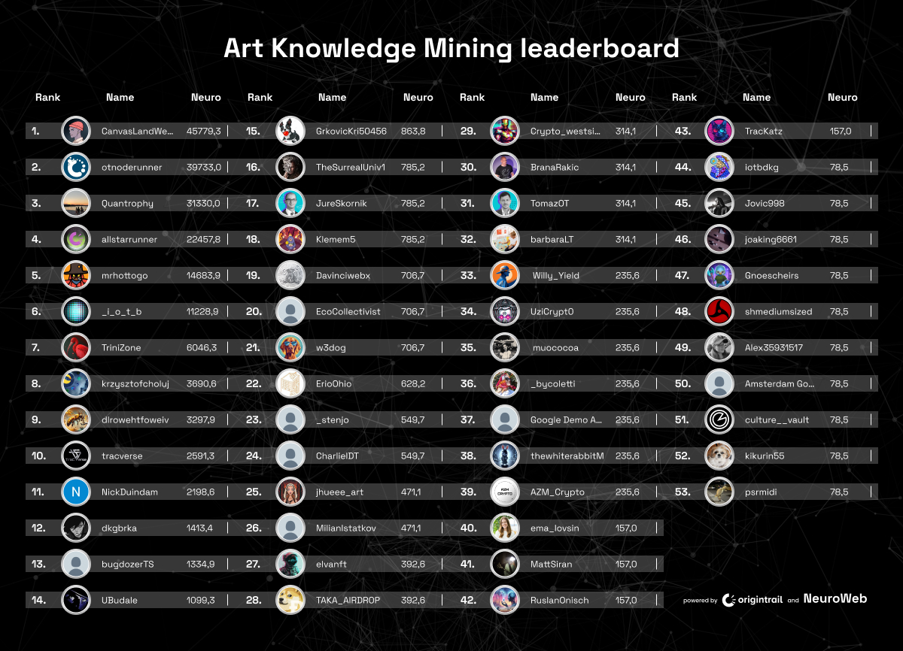

# Knowledge mining beta program

The Knowledge mining beta program is intended to kick-start knowledge mining capabilities through an iterative process of **crowdsourcing knowledge** for decentralized artificial intelligence (AI) through NeuroWeb blockchain and NEURO token. During the beta knowledge mining program, a token pool of **200,000 NEURO** will be made available for miners contributing knowledge.

The knowledge mining beta program aims to feed learnings on the various approaches to incentivising knowledge mining via the NeuroWeb blockchain, ultimately implementing knowledge mining capabilities in production.

The beta program was focused on Art knowledge mining.

## Art Knowledge Mining

Compete for your part of the **200,000 NEURO** rewards pool among the vibrant community of artists that are adding their creations to the OriginTrail Decentralized Knowledge Graph as the first group of Knowledge miners.

Art knowledge mining is closed, scroll down to check final leaderboard of knowledge miners that contributed Art.

### Art Knowledge Mining via X

To get started with knowledge mining for art on X you can utilize the @ChatDKG X bot.\
\
To mine knowledge you can use the following commands:

* _**/mint**_ command, which creates a new [knowledge asset](https://docs.origintrail.io/decentralized-knowledge-graph-layer-2/dkg-basic-concepts#what-is-a-knowledge-asset) from an existing image
* _**/imagine**_ command, which creates a derivative art piece and corresponding knowledge asset from a provided art knowledge asset, with an appropriate connection in the DKG

To use the /mint command, simply tweet:

<pre data-overflow="wrap"><code><strong>/mint @ChatDKG [Artwork Name] | [Description] | [Artform] | [Author Name] | [Image URL]
</strong></code></pre>

<figure><figcaption></figcaption></figure>

To use the /imagine command, simply tweet:


```
/imagine @ChatDKG [UAL of original artwork] | [Prompt for the new image] | [New artwork name] | [New artwork Description] | [Author Name]
```


<figure><figcaption></figcaption></figure>

## Leaderboard

<figure><figcaption></figcaption></figure>
