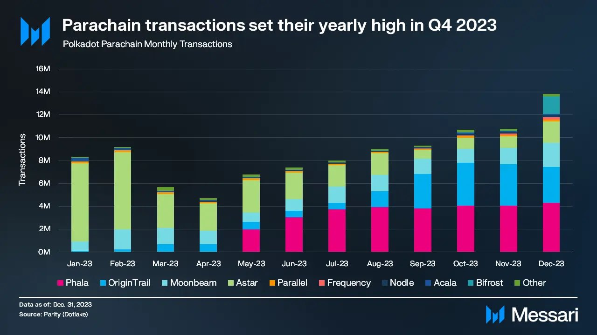

# Crowdloan

[NeuroWebAI](http://neuroweb.ai) (previously OriginTrail Parachain) is approaching its 2nd bid for a parachain slot on Polkadot. NeuroWeb was the [fastest growing parachain](https://twitter.com/DrevZiga/status/1752949817658020092) in the last 6 months (currently ranked #2 for the amount of transactions among all parachains) and has just seen the launch of [Knowledge mining BETA](https://x.com/NeuroWebAI/status/1747323072015720474?s=20) & [PolkaBot.ai](https://twitter.com/PolkabotAI), widely showcasing its utility value.&#x20;

### NeuroWebAI core functionalities

* [x] DKG & EVM Support
* [x] On-chain Governance
* [x] Knowledge mining for Decentralized AI (ongoing)
* [ ] Collators system
* [ ] Community Treasury
* [ ] Knowledge contracts & discovery

<figure><figcaption>
NeuroWeb (previously OriginTrail Parachain) was the<a href="https://twitter.com/DrevZiga/status/1752949817658020092"> fastest growing parachain </a>in the last 6 months
</figcaption></figure>

The 2nd auction will ensure the parachain slot for another 2 years. **Targeted auction slot: #62**

Voting on NeuroWeb referendum that is supporting this crowdloan is active and you can participate [here](https://polkadot.js.org/apps/?rpc=wss%3A%2F%2Fparachain-rpc.origin-trail.network#/democracy), or read [voting-on-a-referendum.md](../on-chain-governance/voting-on-a-referendum.md "mention") instructions.

#### Rewards amount

Total rewards to be distributed in a winning auction: **20,000,000 NEURO**

#### Rewards distribution

* Distribution relative to contributions - 16MM NEURO
* Contributions size #2-50\* - 2MM NEURO (40,816 NEURO per contributor)
* Biggest contributor\* - 2MM NEURO

Hardcap for contributions:  250,000 DOT


The relevant ranking for rewards is determined at the winning block. If there are less than 50 contributors at the time of winning, the undistributed rewards are to be returned to Future auctions pool.


